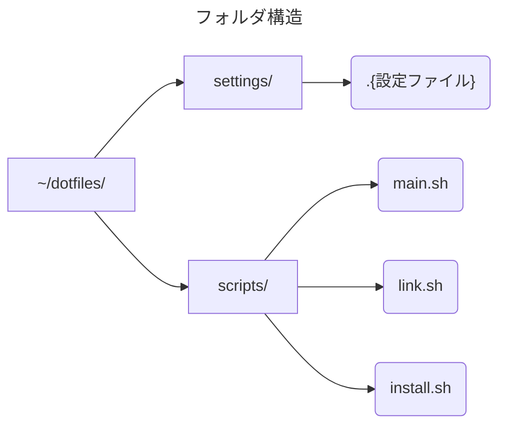

# DOTFILES


# 概要


dotfilesではlinuxディストリビューションの<font color=Salmon>設定ファイル</font>(" . "から始まるファイルのためdotfiles)を  
管理するためのファイル.  
githubなどで管理する

今回はコンパイラなどの<font color=Salmon>自動インストール</font>もサポートする


# 仕組み


## フォルダ配置





## それぞれの内容


- ### `~/dotfiles/`  
    rootファイル.  
    dotfiles全体を含み、githubで管理する
  
  
- ### `settings/`  
    " . "で始まる設定ファイル全体を管理する(.bashrc)など  
    普通のdotfilesではこの中身しか管理しない
  
  
- ### `scripts/`  
    シェルスクリプト(linuxのbashの自動化ツール)を管理する  
    `main.sh`から`link.sh`,`install.sh`を実行する  
    linkではsettingsの配置, installではコンパイラなどのツールの自動インストールを行う
  
  
- ### `.{設定ファイル}`  
    設定ファイル本体たち
  
  
- ### `install.sh`  
    コンパイラなどのプログラム用ツールのインストールを行う
  
  
- ### `link.sh`  
    `ln -s`コマンドを用いて, `~/dotfiles/setting/` の中身を`~/ (ホームディレクトリ直下)`にリンク(展開)する.
  
  
- ### `main.sh`  
    `link.sh`,`install.sh`を実行する  
    <font color=Salmon>githubからダウンロードしたらまずこのシェルスクリプトを実行する</font>


---


- # `dotfiles/settings/*`


今回はファイルの中身(設定)として以下のようなファイルを用意する

```bash
#linuxの基本的な設定ファイル
.bashrc

#aliasのみを抜き出したlinuxの設定
.bash_aliases
```


### .bashrc

linux(ubuntu)の基本的な設定を記述する  
例えば環境変数の設定(export)などを行う


### .bash\_aliases

`.bashrc`に記述する設定のうちalias(コマンドのショートカットを作成する設定)のみを抜き出して記述する   
<例>  
alias py='python3'  
python3 → py で起動できるようにする


- # `dotfiles/scripts/install.sh`


### 実装方法

- 今回のdotfilesでは、ツールのインストール時にそれぞれのアプリをインストールするかを`Yes`か`No`で指定できるようにしたい

- for文でインストールするかのチェック用フラグを作成する

- for文でそのフラグに沿ってインストールコマンドを呼び出していく

- コマンドは全文を記述する(`sudo apt install`までは被ることが多い)  
    というのも`sudo apt install`のみではインストールできないパッケージも多いため柔軟に対応する


### 実装

そうして以下のように実装した

`dotfiles/scripts/install.sh`
```bash
#!/bin/bash


#インストールフラグ
#(True: インストール, False: インストールしない)
flags=()

#インストールコマンド
#以下のように1つのテキスト内にアプリ名とコマンドを空白で分割して配列に入れる
#(
#       "{アプリ名1} {コマンド1}"
#       "{アプリ名2} {コマンド2}"
#       "{アプリ名3} {コマンド3}"
#       "{アプリ名4} {コマンド4}"
#)
commands=(
        "command1 echo command1"
        "command2 echo command2"
        "command3 echo command3"
        "command4 echo command4"
        )

#OS自体のアップデート
echo "--- OS updates ---"
echo "...sudo apt update"
sudo apt update
echo "...sudo apt dist-upgrade"
sudo apt dist-upgrade
echo "...sudo apt autoremove"
sudo apt autoremove
echo "--- done ---"
echo ""

#インストールフラグ設定
echo "--- installation settings ---"

for id in "${!commands[@]}"
do
        #コマンド列を配列から取得
        command=(${commands[$id]})
        #アプリ名を取得
        applicationName=${command[0]}
        #コマンドを取得
        installationCommand=${command[@]:1}

        #インストールの質問
        echo -n "install ${applicationName} [y/n]:"

        #入力受付
        read flag
        if [ "$flag" = "y" ]; then
                #yと入力されたならフラグをtrueで登録
                flags+=(true)
        else
                #Enterやnなどy以外ならフラグをfalseで登録
                flags+=(false)
        fi
done

echo "--- done ---"
echo ""

#インストール
echo "--- start installing --- "

for id in "${!commands[@]}"
do
        #インストールフラグを参照
        if ${flags[id]}; then
                #コマンド列を配列から取得
                command=(${commands[$id]})
                #アプリ名を取得
                applicationName=${command[0]}
                #コマンドを取得
                installationCommand=${command[@]:1}

                #インストールコマンドを表示
                echo "...${installationCommand}:"
                #インストールコマンドを実行
                $installationCommand
        fi
done

echo "--- done ---"
echo ""
```


- # `dotfiles/scripts/link.sh`


### 実装方法

- 今回は~/* (ホームディレクトリ直下)にシンボリックリンクを展開することによって  
    OSやアプリに設定を読み込ませる

- シンボリックリンク(`ln -s`):  
    windowsのアプリのショートカットのようなもの.実体は生成されない

### 実装

そうして以下のように実装した

```bash
#!/bin/bash


#シェルスクリプトの場所に移動
cd $(dirname $0)
#settingsフォルダに移動
cd ../settings/

#ファイル一覧を取得
files=$(ls -a)

#settingsフォルダの中身をホームディレクトリ直下にシンボリックリンクする
echo "--- setting links ---"
#ファイルの数ループ
for f in $files
do

	if [ $f != "." ]; then
		if [ $f != ".." ]; then
			echo "$(pwd)/$f"
			echo "~/$f"
			ln -sfn "$(pwd)/$f" "${HOME}"
		fi
	fi

done

echo "--- done ---"
echo ""
```


- # `dotfiles/scripts/main.sh`


install.shとlink.shをまとめて実行する

```bash
#!/bin/bash


#シェルスクリプトの場所に移動
cd $(dirname $0)

#intall.shを実行
./install.sh

#link.shを実行
./link.sh
```


# 実行方法


## インストール


1. ホームディレクトリ直下に `~/dotfiles/*`と配置する

2. `~/dotfiles/scripts/main.sh`を実行する

3. コマンドの指示に従って設定する


## 設定方法


- ツールのインストールは`install.sh`の`commands`に追加する

- 設定ファイルは`~/dotfiles/settings/*`内に入れておくだけでよい  
    とくに、登録などしなくてよい
